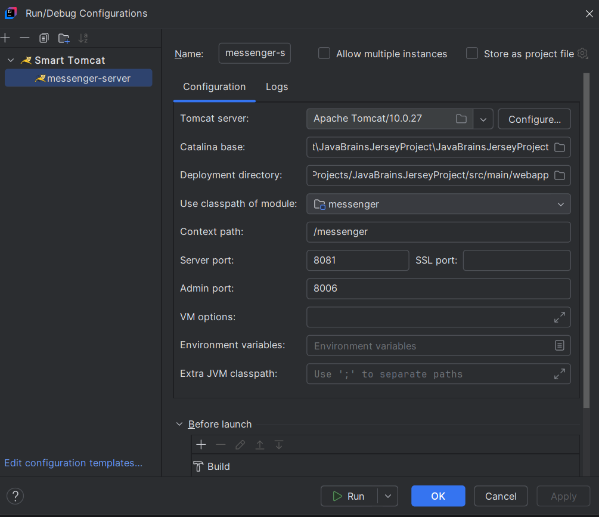

MESSENGER APP

1. Jersey project with jax-rs implementation
2. Maven archetype: jersey-quickstart-webapp (3.1.1)

URLS

1.http://localhost:8081/messenger/ (base url)
1. GET /messenger/webapi/myresource 
2. GET /messenger/webapi/messages/text 
3. GET /messenger/webapi/messages/json
4. GET /messenger/webapi/messages/
    GET /messenger/webapi/messages?year?=2025 (filter the records based on year) 
    GET /messenger/webapi/messages?start=2&size=2 (filter the records based on starting point and size of the records to fetch)
5. GET /messenger/webapi/messages/{messageId} (messageId is a path parameter, e.g., 1,2)
6. POST /messenger/webapi/messages/ (message is a JSON object in the request body)
7. PUT /messenger/webapi/messages/{messageId} (messageId is a path parameter, e.g., 1,2) (message is a JSON object in the request body)
8. PATCH /messenger/webapi/messages/{messageId} (messageId is a path parameter, e.g., 1,2) (message is a JSON object in the request body)
    e.g., {"message":"updated message"} 
9. DELETE /messenger/webapi/messages/ (Deleted all messages)
10. DELETE /messenger/webapi/messages/{messageId} (messageId is a path parameter, e.g., 1,2)
11. GET /messenger/webapi/messages/hello;name=yourName (URL with Matrix param , name value can be any string)
    e.g., /messenger/webapi/messages/hello;name=John
    e.g., /messenger/webapi/messages/hello;name=John;age=30 (multiple matrix params) (possible but not applied in code)

TOMCAT SETUP

